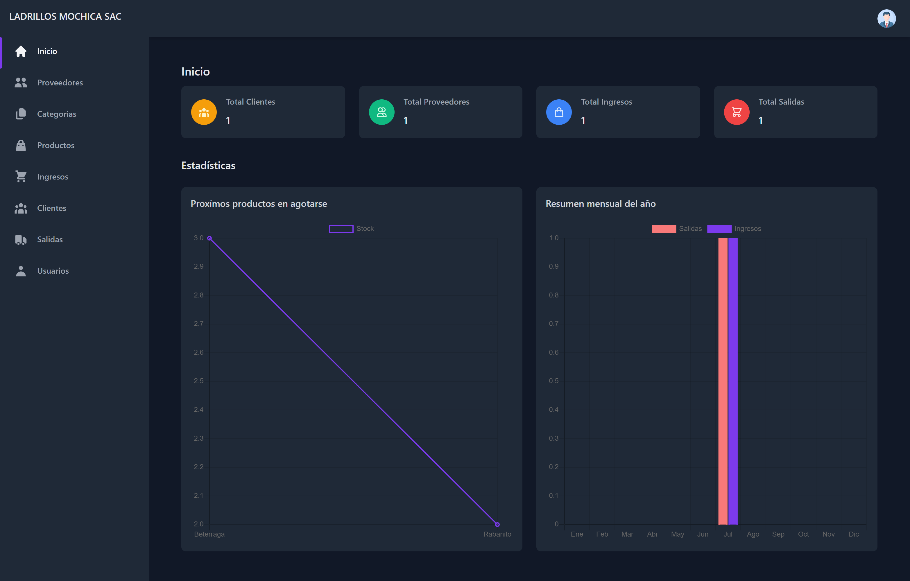

# Sistema de Almacén

Sistema para almacén, la cual fue desarrollada en laravel jetstream - inertia  y vuejs. 

## Tabla de contenido

- [Captura](#capura)
- [Modulos](#modulos)
- [Construcción](#construcción)
- [Autor](#autor)

### Captura

### Modulos

- ✔️ **Inicio**: con las opciones de `Reportes graficos`
- ✔️ **Proveedores**: con las opciones de `listar`,`buscar`,`crear`, `editar` y `eliminar`
- ✔️ **Categorias**: con las opciones de `listar`,`buscar`,`crear`, `editar` y `eliminar`
- ✔️ **Productos**: con las opciones de `listar`,`buscar`,`crear`, `editar` y `eliminar`
- ✔️ **Ingresos**: con las opciones de `listar`,`buscar`,`crear` y `eliminar`
- ✔️ **Clientes**: con las opciones de `listar`,`buscar`,`crear`, `editar` y `eliminar`
- ✔️ **Salidas**: con las opciones de `listar`,`buscar`,`crear` y `eliminar`
- ✔️ **Usuarios**: con las opciones de `listar`,`buscar`,`crear`, `editar` y `eliminar`

### Construcción

- Marcado HTML5 semántico
- [Tailwindcss](https://tailwindcss.com/) - Framework de css
- [Laravel Jetstream](https://jetstream.laravel.com/2.x/stacks/inertia.html) - Framework php
- [Vue.js](https://vuejs.org/) -  Framework de Javascript

## Autor

- Eli valderrama Armas - [@Eli-Hamer](https://www.facebook.com/eli.valderramaarmas)
